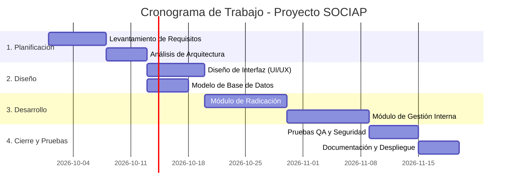

```mermaid
gantt
    title Cronograma de Trabajo - Proyecto SOCIAP
    dateFormat  YYYY-MM-DD
    section 1. Planificación
    Levantamiento de Requisitos  :a1, 2026-10-01, 7d
    Análisis de Arquitectura      :a2, after a1, 5d
    section 2. Diseño
    Diseño de Interfaz (UI/UX)    :b1, after a2, 7d
    Modelo de Base de Datos      :b2, after a2, 5d
    section 3. Desarrollo
    Módulo de Radicación          :c1, after b1, 10d
    Módulo de Gestión Interna     :c2, after c1, 10d
    section 4. Cierre y Pruebas
    Pruebas QA y Seguridad       :d1, after c2, 6d
    Documentación y Despliegue   :d2, after d1, 5d
```
